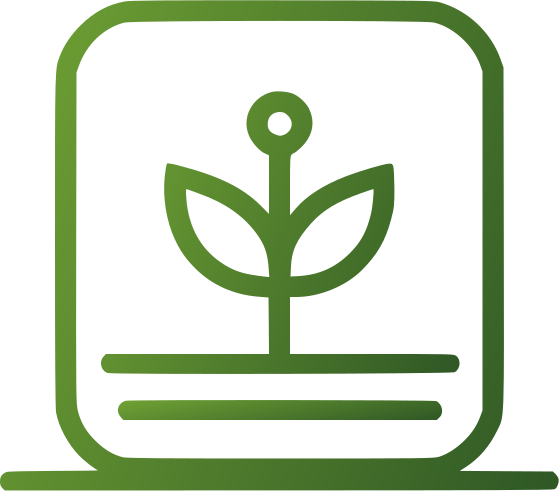

### Orientadores:

- Prof. Jean Carlos Lourenço Costa
- Prof. Fernando Masanori
- Prof. Fabricio Galende Marques de Carvalho
- Profa. Juliana Forin Pasquini Martinez

    <a href="#sobre">Sobre o projeto</a>  |  
    <a href="#demostracao">Demostração</a>  |  
    <a href="#tecnologias">Tecnologias utilizadas</a>  |  
    <a href="#backlog">Backlog do produto</a>  |  
    <a href="#autores">Autores</a>

   

 

# 🔎 Sobre o projeto

## 📑 Descrição do Problema

O Smart Farm é uma câmera tecnológica que integra um sofisticado sistema de monitoramento de dados ambientais, sendo especialmente projetado para otimizar o cultivo de plantas e hortaliças. Atualmente, a coleta e análise dos dados são realizadas manualmente por meio da aplicação Excel. No entanto, esse método se mostra moroso e exigente para a equipe, além de dificultar o acompanhamento eficaz do desenvolvimento das plantas.

## 🎯 Objetivo  

Desenvolver um painel de visualização que permita o monitoramento constante da estufa através de gráficos e automatizar o processo de coleta e armazenamento de dados,com o intuito de solucionar as problemáticas apresentadas pelo cliente.

## 📅 Entrega de Sprints

Sprint | Previsão | Status|
|------|--------|------|
|Kick Off | 11/03/2024 a 15/03/2024 | ✔️ concluido |
|01 | 25/03/2024 a 14/04/2024 | ✔️ concluido |
|02|  15/04/2024 a 05/05/2024|  ✔️ concluido |
|03| 06/05/2024 a 26/05/2024 |  ✔️ concluido |
|04| 27/05/2024 a 16/06/2024 | a fazer |
|Feira de Soluções| 27/06 | a fazer |

 

  
# 💻 Demonstração

Apresentação das funcionalidades desenvolvidas até o momento:

# 🛠️ Tecnologias Utilizadas

As seguintes ferramentas, linguagens, bibliotecas e tecnologias foram usadas na construção do projeto:

 

# 📘 Munual do usuário

Para ter informações de:
- Processo de instalação
- Acesso do programa
- Funções da plataforma

[Acesse aqui!](https://github.com/andresalerno/projeto_api/blob/main/Manual.pdf)

# 🧾 Backlog do produto

Requisito funcional | Sprint | Prioridade |
|------|--------|------|
| Exibir os últimos dados coletados das variáveis essenciais: temperatura, umidade do solo, umidade ambiente e volume da água. | 1 | Alta |
| Importar e converter dados de um arquivo CSV. | 2 | Alta |
| Apresentar os gráficos, incluindo datas e horários de captura.| 2 | Alta |
| Exportar dados de um período selecionado pelo usuário em CSV.| 2 | Média |
| Armazenar os dados no banco de dados. | 3 | Alta |
| Permitir a seleção de conjuntos de dados e combinações para períodos específicos, incluindo filtragem de dados | 3 | Alta |

## Sprint 1. Concepção
- [x] Definir o propósito do projeto;
- [x] Elaborar o protótipo da aplicação;
- [x] Escolher a identidade visual;
- [x] Configurar o ambiente de desenvolvimento;
- [x] Desenvolver a base do website;
- [x] Elaborar o backlog inicial e o plano de entrega;
- [x] Integrar os gráficos gerados a partir de um arquivo CSV com a interface do usuário;
- [x] Empacotar a aplicação com Docker;
- [x] Criar o vídeo de apresentação;
- [x] Implementar a funcionalidade de importação de arquivos CSV no site;
- [x] Realizar a transformação automática dos dados em gráficos.

## Sprint 2. Desenvolvimento do Projeto
- [x] Desenvolver a funcionalidade de importação e conversão automática dos dados do CSV para o banco de dados;
- [x] Permitir o download de todos os dados;
- [x] Implementar a exibição dos últimos dados coletados das variáveis essenciais;
- [x] Testar a funcionalidade de apresentação de gráficos e exportação de dados;
- [x] Desenvolver a funcionalidade de armazenamento dos dados no banco de dados;
- [x] Realizar a adaptação da página web para diferentes dispositivos e tamanhos de tela.

## Sprint 3. Implementação
- [x] Permitir o download dos dados selecionados;
- [x] Hospedar o website a partir do Raspberry Pi 3;
- [x] Implementar a seleção de conjuntos de dados e combinações para períodos específicos, incluindo a filtragem de dados;
- [x] Testar a responsividade da página e a funcionalidade de filtragem.

## Sprint 4. Operacionalização
- [ ] Implementar o botão de limpar filtro
- [ ] Implementar função de baixar por período selecionado pelo filtro
- [ ] Tratamento do erro de ao filtrar o período deve permanecer no input
- [ ] Tratamento do erro de filtro de data inexistente no banco
- [ ] Tratamento do erro de importar dados duplicados
- [ ] Realizar testes de integração para garantir o funcionamento correto de todas as funcionalidades;
- [ ] Corrigir eventuais bugs encontrados durante os testes.

 

# 👥 Autores

|    Função     | Nome                                  |                                                                                                                                                      LinkedIn & GitHub                                                                                                                                                      |
| :-----------: | :------------------------------------ | :-------------------------------------------------------------------------------------------------------------------------------------------------------------------------------------------------------------------------------------------------------------------------------------------------------------------------: |
| Product Owner |   Mariane Valério Nunes         |                    |
| Scrum Master  | André Salerno |            |
| Team Member   | Eric Lourenço Mendes da Silva      |                  |
|  Team Member  | Gustavo Muraoka Silva                 |                  |
|  Team Member  | Sarah Montuani Batagioti               |       |
|  Team Member  | Karen de Cássia Gonçalves     |               |
|  Team Member  | Brenno Rosa Lyrio de Oliveira               |       |
|  Team Member  | Guilherme dos Santos Benedito               |       |
|  Team Member  | Arthur Johannes Rodrigues Peres y Peres              |       |

